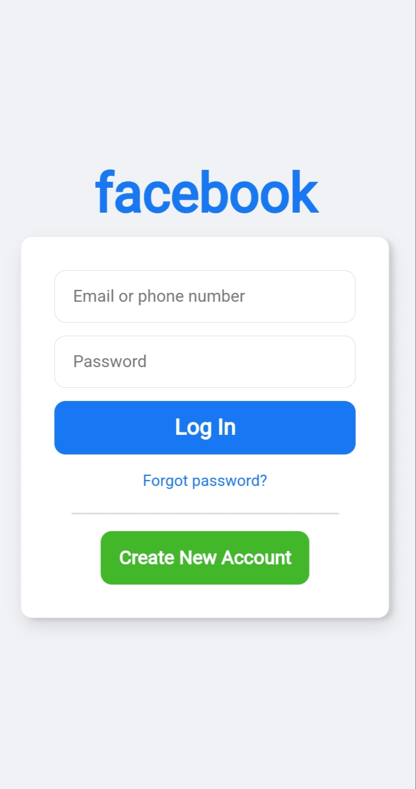

# 🛰️ ESP8266 WiFi Captive Portal | Ethical Hacking Demo
> **Cybersecurity Awareness using ESP8266 + Fake Login Page**

---

#⚠️ LEGAL DISCLAIMER
This project is for EDUCATIONAL PURPOSES ONLY. 
Do not use this tool on unauthorized networks.  
Unauthorized use is ILLEGAL and punishable by law.

---

## The login portal looks like below:


---

## 📚 Project Summary
Turn your **ESP8266 NodeMCU** into a fake WiFi hotspot that shows a **captive portal login page** to connected devices.

This project demonstrates:
- How public WiFi captive portals function
- How attackers use **phishing tactics**
- How users can **protect themselves** from such tricks

---

## 🧰 Hardware Requirements

| Component         | Description             | Quantity |
|------------------|-------------------------|----------|
| ESP8266 NodeMCU   | WiFi microcontroller     | 1        |
| Micro-USB Cable   | Power & Programming      | 1        |
| LED (Optional)    | Status indicator         | 1        |

---

## ⚙️ Installation Steps

### 1. Install Arduino IDE
- Download from: https://www.arduino.cc/en/software

### 2. Add ESP8266 Board Support
- Open **Arduino IDE > Preferences**
- Add the following URL to *Additional Boards Manager URLs*:
  ```
  http://arduino.esp8266.com/stable/package_esp8266com_index.json
  ```
- Go to **Tools > Board > Boards Manager** and install:
  ```
  ESP8266 by ESP8266 Community
  ```

### 3. Install Required Libraries
Use the **Library Manager** to install:
- `ESP8266WiFi`
- `DNSServer`
- `ESP8266WebServer`

---

### 🔐 Login Capture Endpoint

When a user connects to the fake WiFi and submits the **login form** on the captive portal, their **entered credentials** (such as username and password) are sent to this local endpoint:

```
http://192.168.4.1/pass
```

The ESP8266 intercepts this request, and:
- **Logs the submitted information**
- **Prints it in the Serial Monitor** (baud rate `115200`)  
- Example output:
  ```
  [+] Captive login received!
  Username: victim@example.com
  Password: 12345678
  ```

> **Note:** The `/pass` endpoint is part of the backend logic in the code, and does **not show anything in the browser** — it silently logs the data for demo purposes.

---

## 🛡️ Safety & Awareness Tips
- Avoid using **open or unknown WiFi networks**
- Look for **HTTPS** and secure certificates in the browser
- Never submit passwords on suspicious or unsecured login forms
- Always verify the **network name (SSID)**

---

## 🏷️ Tags
`#ESP8266` `#WiFiHack` `#EthicalHacking` `#CaptivePortal` `#PhishingDemo`  
`#CyberSecurity` `#IoTProjects` `#Arduino` `#WiFiSniffer` `#EducationOnly`

---

## 📌 Note
Want to enhance this? Add:
- HTML templates for login page
- SPIFFS file system to serve better web assets
- Data logging to SD card or remote server

---

**Created for ethical hacking demonstrations & cybersecurity awareness. Stay safe, stay smart!**